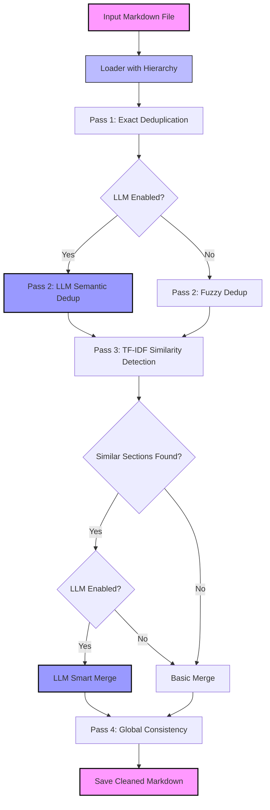

# md_dedup


AI Agent for Markdown deduplication and cleanup built using LangChain and OpenAI. Designed to process large Markdown files with hierarchical structure, remove redundancy, merge overlapping sections intelligently, and maintain document coherence.

---

## Table of Contents

- [Features](#features)
- [Requirements](#requirements)
- [Dependencies](#dependencies)
- [Installation and Setup](#installation-and-setup)
- [Architecture](#architecture)
- [Configuration](#configuration)
- [Next Steps](#next-steps)
- [License](#license)

## Features

- ✅ Preserves document structure/Hierarchy (H1, H2, H3, etc.)
- ✅ 4-Pass Pipeline: Exact dedup → Semantic dedup → Smart merging → Global consistency
- ✅ Maintains parent-child relationships when merging sections
- ✅ TF-IDF Similarity Detection: Only merges sections that are actually similar
- ✅ Works with or without OpenAI API
- ✅ Only compares sections at same hierarchical level with same parent
- ✅ Catches semantic duplicates, not just exact matches

## Requirements

- **Python**: 3.10 or higher
- **OpenAI API Key** (optional – only required for LLM mode)

## Dependencies

```
click>=8.0.0
langchain>=0.1.0
langchain-openai>=0.0.5
openai>=1.0.0
scikit-learn>=1.0.0
numpy>=1.21.0
```

## Installation and Setup

1. Clone Repository

```bash
git clone https://github.com/<your-username>/md_dedup.git
cd md_dedup
```

2. Python Virtual Environment

```bash
python -m venv venv
source venv/Scripts/activate  # Windows Git Bash
source venv/bin/activate      # Linux/macOS
```

3.  Install Dependencies

```bash
pip install -r requirements.txt
```

5.  Set OpenAI API Key (Optional - for LLM mode)

```bash
$env:OPENAI_API_KEY="your_api_key_here" # powershell
export OPENAI_API_KEY="your_api_key_here" # bash
```

6.  Run

```bash
python -m md_dedup.cli --input <input_file.md> --output <output_file.md>
```

## Architecture/Pipeline



1. **Pass 1: Exact Deduplication**
   - Removes identical duplicate lines within each section
   - Fast, deterministic cleanup

2. **Pass 2: Semantic Deduplication**
   - **LLM Mode:** Uses AI to identify and remove semantically duplicate content
   - **Basic Mode:** Uses fuzzy string matching (difflib) to catch similar lines

3. **Pass 3: Section Merging**
   - Calculates TF-IDF similarity between sections
   - Only compares sections at same hierarchical level with same parent
   - **LLM Mode:** AI-powered intelligent merging
   - **Basic Mode:** Simple content concatenation with deduplication

4. **Pass 4: Global Consistency**
   - Removes duplicate lines across all sections
   - Processes each hierarchy level independently
   - Preserves headings and structure

## Configuration

Edit `md_dedup/config.py` to customize behavior:

```python
# Enable/disable OpenAI usage
USE_LLM = False

# OpenAI model settings (only used when USE_LLM = True)
MODEL_NAME = "gpt-3.5-turbo"
TEMPERATURE = 0  # 0 = deterministic, higher = more creative

# Similarity thresholds
SIMILARITY_THRESHOLD = 0.7        # 0.0-1.0, lower = merge more sections
SEMANTIC_DEDUP_THRESHOLD = 0.85   # 0.0-1.0, lower = remove more duplicates
```

- When `USE_LLM = False`: Basic mode with exact duplicate removal, fuzzy matching, and TF-IDF similarity detection (no API required, works offline)
- When `USE_LLM = True`: AI-powered semantic deduplication and intelligent section merging (requires OpenAI API key and credits)

## Next Steps

- [ ] **Performance optimization** – Batch LLM calls, caching
- [ ] **Support for other formats** – HTML, reStructuredText, AsciiDoc
- [ ] **Analytics dashboard** – Show stats on removed content, savings
- [ ] **Unit tests** – Automated validation and regression testing
- [ ] **Interactive mode** – Review changes before applying
- [ ] **Diff output** – Show what was changed/merged
- [ ] **Local LLM support** – Ollama, LLaMA integration
- [ ] **Configurable merging strategies** – Aggressive, conservative, balanced

## Contributing

Contributions welcome! Please:

1. Fork the repository
2. Create a feature branch
3. Make your changes
4. Submit a pull request

## License

This project is licensed under **CC BY-NC 4.0 (Creative Commons Attribution-NonCommercial 4.0 International)**:

- ✅ Free to **view, run, and experiment** for educational purposes
- ✅ Free for **personal and academic use**
- ❌ **Non-commercial use only**
- ❌ Commercial use, redistribution, or sale requires explicit permission from the author

For full license text, see [LICENSE](./LICENSE)

---

**Author:** Talha Yousuf
**Repository:** https://github.com/talha-yousuf/md_dedup
