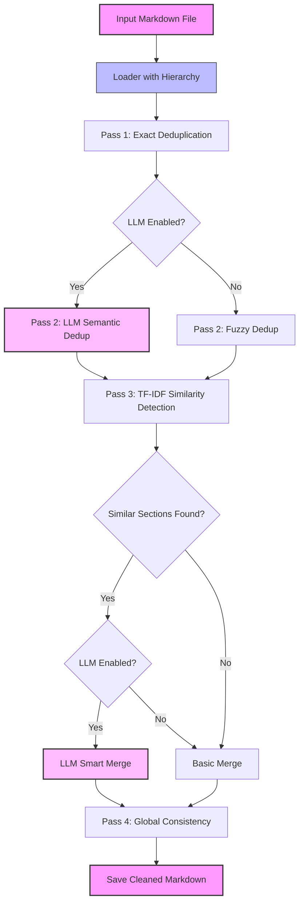

# md_dedup


AI Agent for Markdown deduplication and cleanup built using LangChain and OpenAI. Designed to process large Markdown files with hierarchical structure, remove redundancy, merge overlapping sections intelligently, and maintain document coherence. Supports both LLM-powered and basic (no-API) modes.

---

## Table of Contents

- [Features](#features)
- [Requirements](#requirements)
- [Dependencies](#dependencies)
- [Installation and Setup](#installation-and-setup)
- [Usage](#usage)
- [Modes of Operation](#modes-of-operation)
- [Architecture](#architecture)
- [Configuration](#configuration)
- [Design Decisions](#design-decisions)
- [Next Steps](#next-steps)
- [License](#license)

## Features

- ✅ **Hierarchical Section Parsing** – Preserves document structure (H1, H2, H3, etc.)
- ✅ **4-Pass Intelligent Pipeline** – Exact dedup → Semantic dedup → Smart merging → Global consistency
- ✅ **Subsection Support** – Maintains parent-child relationships when merging sections
- ✅ **TF-IDF Similarity Detection** – Only merges sections that are actually similar
- ✅ **Dual Mode** – Works with or without OpenAI API
- ✅ **Smart Comparison** – Only compares sections at same hierarchical level with same parent
- ✅ **Fuzzy Duplicate Detection** – Catches semantic duplicates, not just exact matches

## Requirements

- **Python**: 3.10 or higher
- **OpenAI API Key** (optional – only required for LLM mode)

## Dependencies

```
click>=8.0.0
langchain>=0.1.0
langchain-openai>=0.0.5
openai>=1.0.0
scikit-learn>=1.0.0
numpy>=1.21.0
```

## Installation and Setup

### 1. Clone Repository

```bash
git clone https://github.com/<your-username>/md_dedup.git
cd md_dedup
```

### 2. Create Python Virtual Environment

```bash
python -m venv venv
```

### 3. Activate Virtual Environment

**PowerShell:**

```powershell
.\venv\Scripts\Activate.ps1
```

**Git Bash / MINGW64 / Linux / macOS:**

```bash
source venv/Scripts/activate  # Windows Git Bash
source venv/bin/activate      # Linux/macOS
```

### 4. Install Dependencies

```bash
pip install -r requirements.txt
```

### 5. Set OpenAI API Key (Optional - for LLM mode)

**PowerShell:**

```powershell
$env:OPENAI_API_KEY="your_api_key_here"
```

**Git Bash / MINGW64:**

```bash
export OPENAI_API_KEY="your_api_key_here"
```

**For persistence**, add to `~/.bashrc` (Linux/Mac) or `~/.bash_profile` (Git Bash):

```bash
export OPENAI_API_KEY="your_api_key_here"
source ~/.bashrc  # reload
```

## Usage

### Basic Command

```bash
python -m md_dedup.cli --input <input_file.md> --output <output_file.md>
```

### Examples

```bash
# Process a documentation file
python -m md_dedup.cli --input docs.md --output docs-cleaned.md

# Process with subsections
python -m md_dedup.cli --input api-docs.md --output api-docs-clean.md
```

## Modes of Operation

### LLM Mode

**Requires:** OpenAI API key and credits

**Features:**

- AI-powered semantic deduplication
- Intelligent section merging with context awareness
- Natural language understanding of content

**Enable in `config.py`:**

```python
USE_LLM = True
```

### Basic Mode (No API Required)

**Requires:** No API key, works offline

**Features:**

- Exact duplicate removal
- Fuzzy matching for similar content (difflib)
- TF-IDF based similarity detection
- Basic section merging

**Enable in `config.py`:**

```python
USE_LLM = False
```

## Architecture

### Pipeline Overview



### 4-Pass Processing

1. **Pass 1: Exact Deduplication**
   - Removes identical duplicate lines within each section
   - Fast, deterministic cleanup

2. **Pass 2: Semantic Deduplication**
   - **LLM Mode:** Uses AI to identify and remove semantically duplicate content
   - **Basic Mode:** Uses fuzzy string matching (difflib) to catch similar lines

3. **Pass 3: Section Merging**
   - Calculates TF-IDF similarity between sections
   - Only compares sections at same hierarchical level with same parent
   - **LLM Mode:** AI-powered intelligent merging
   - **Basic Mode:** Simple content concatenation with deduplication

4. **Pass 4: Global Consistency**
   - Removes duplicate lines across all sections
   - Processes each hierarchy level independently
   - Preserves headings and structure

## Configuration

Edit `md_dedup/config.py` to customize behavior:

```python
# Enable/disable LLM features
USE_LLM = False  # Set to True for AI-powered mode

# OpenAI model settings
MODEL_NAME = "gpt-3.5-turbo"
TEMPERATURE = 0  # 0 = deterministic, higher = more creative

# Similarity thresholds
SIMILARITY_THRESHOLD = 0.7        # 0.0-1.0, lower = merge more sections
SEMANTIC_DEDUP_THRESHOLD = 0.85   # 0.0-1.0, lower = remove more duplicates
```

## Design Decisions

### Why Hierarchical Structure?

- Preserves document organization
- Prevents inappropriate merging of unrelated sections
- Maintains parent-child relationships in subsections

### Why Dual Mode?

- **LLM Mode:** Best quality, context-aware processing
- **Basic Mode:** No API costs, works offline, still effective

### Why TF-IDF for Similarity?

- Industry-standard text similarity metric
- Fast and efficient
- Works without external APIs
- Good balance of accuracy vs. performance

### Why 4 Passes?

- **Incremental refinement** – Each pass handles different types of redundancy
- **Fail-safe design** – If one pass fails, others still work
- **Modular** – Easy to add/remove/modify individual passes

## Project Structure

```
md_dedup/
├── __init__.py          # Package marker
├── cli.py               # Command-line interface
├── config.py            # Configuration settings
├── loader.py            # Markdown parsing with hierarchy
├── passes.py            # Deduplication and similarity logic
├── runner.py            # Pipeline orchestration
└── utils.py             # Helper functions
requirements.txt         # Python dependencies
README.md               # This file
```

## Next Steps

- [ ] **Performance optimization** – Batch LLM calls, caching
- [ ] **Support for other formats** – HTML, reStructuredText, AsciiDoc
- [ ] **Analytics dashboard** – Show stats on removed content, savings
- [ ] **Unit tests** – Automated validation and regression testing
- [ ] **Interactive mode** – Review changes before applying
- [ ] **Diff output** – Show what was changed/merged
- [ ] **Local LLM support** – Ollama, LLaMA integration
- [ ] **Configurable merging strategies** – Aggressive, conservative, balanced

## Troubleshooting

### "ModuleNotFoundError: No module named 'langchain_openai'"

```bash
pip install langchain-openai
```

### "OpenAI API quota exceeded"

- Set `USE_LLM = False` in `config.py` to use basic mode
- Or add credits at https://platform.openai.com/account/billing

### "No sections found to merge"

- Lower `SIMILARITY_THRESHOLD` in `config.py` (e.g., 0.5)
- Check if your sections actually have similar content

### Import errors

```bash
# Reinstall dependencies
pip install --upgrade -r requirements.txt
```

## Contributing

Contributions welcome! Please:

1. Fork the repository
2. Create a feature branch
3. Make your changes
4. Submit a pull request

## License

This project is licensed under **CC BY-NC 4.0 (Creative Commons Attribution-NonCommercial 4.0 International)**:

- ✅ Free to **view, run, and experiment** for educational purposes
- ✅ Free for **personal and academic use**
- ❌ **Non-commercial use only**
- ❌ Commercial use, redistribution, or sale requires explicit permission from the author

For full license text, see [LICENSE](./LICENSE)

---

**Author:** Talha Yousuf  
**Repository:** https://github.com/talha-yousuf/md_dedup  
**Issues:** https://github.com/talha-yousuf/md_dedup/issues
